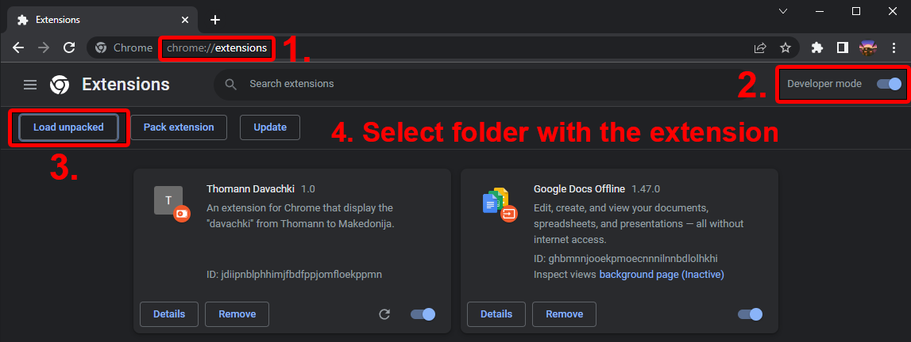

# ThomannDavachki

  

  <h3 align="center">ThomannDavachki</h3>

  

    A Chrome extension that lets you see the "davachki" or additional fees that are required when by Poshta Makedonija when you purchase from Thomann.
  

**Download Link: [ThommannDavachki Releases](https://github.com/AndrejStojkovic/ThomannDavachki/releases/tag/Releases)**

## Table of Contents

- [Changelog](#changelog) 
- [To-do](#to-do) 
- [Installation Guide](#installation-guide) 
- [Previews](#previews) 
- [Bugs and feature request](#bugs-and-feature-requests)
- [Copyright and License](#copyright-and-license)

## Changelog
- Version 1.0: Initial commit and release
- Version 1.1: Re-did the codebase and minor changes and fixes

## To-do:
- Add a function to change the price when the shopping cart is changed

## Installation Guide:

## Previews:

## Bugs and Feature requests
Have a bug or a feature request? Please open an issue at the top of the page of this repository.
And please be as descriptive as possible when opening an issue or if you have a feature request.

## Copyright and License
Code and documentation copyright 2011-2018 the authors. Code released under the MIT License. 
 
Enjoy 🤘 